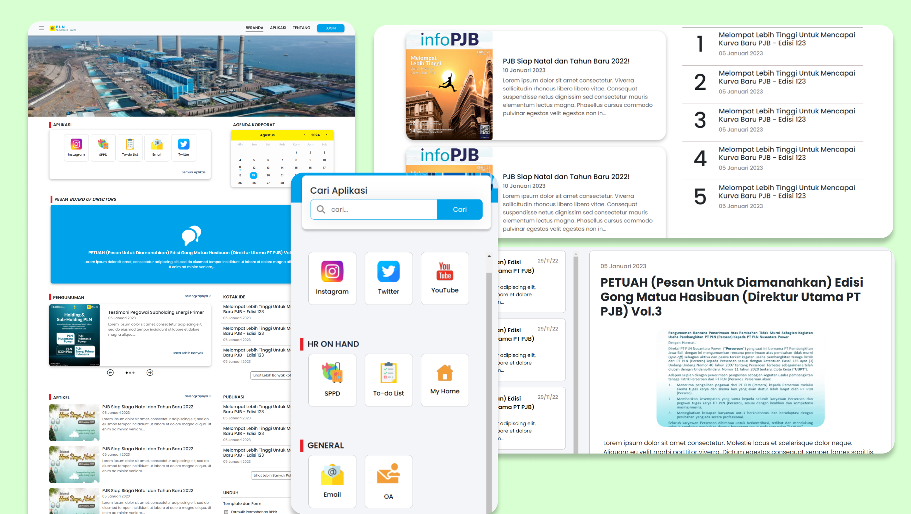

# Hi there, welcome to Portal PLN 👋
The PLN Nusantara Power portal is a website that delivers news updates, event agendas, calendars, and quick access to applications, specifically designed for PT PLN Nusantara Power employees. This website previously used an API from PLN Nusantara Power, which is no longer accessible. If you would like to view the frontend design, you can clone the frontend branch from the repository.

## Installation Instructions
The tools that need to be installed are PHP Version 8.0 or higher and Composer.

1. Create a new folder with any name and navigate to the directory of the new folder.
2. Right-click and select Open in Terminal.
3. Clone the GitHub project through CMD or terminal and type "git clone git clone --branch frontend --single-branch https://github.com/talithaalda/portalpln.git".
4. Next, navigate into the OBE-SI folder and type "composer update".
5. Then, type "cp .env.example .env".
6. Then, type "php artisan key:generate".
7. Type "php artisan serve".
8. Now, the application is running, and you can access it in your browser at "http://127.0.0.1:8000".
9. If you encounter any errors, try running "php artisan optimize".

